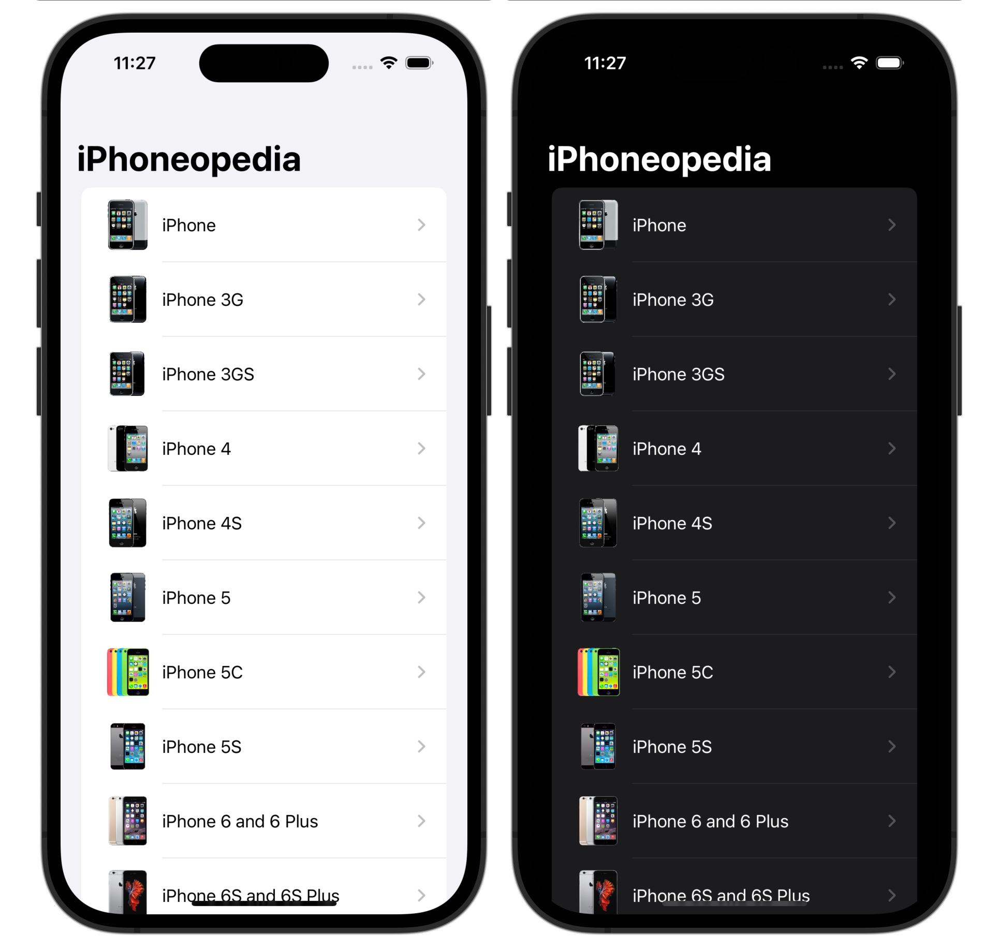

# iPhoneopedia

iPhoneopedia is an iOS app built with SwiftUI that allows users to browse and view information about each iPhone model released by Apple.

### Screenshots

## Features
Browse all iPhone models from the first generation to the latest release.
View detailed information about each iPhone model, including release date, price, technical specifications, and more.
Swipe left or right to switch between iPhone models.
Zoom in and out to see the iPhone model from different angles.
Dark mode support.
