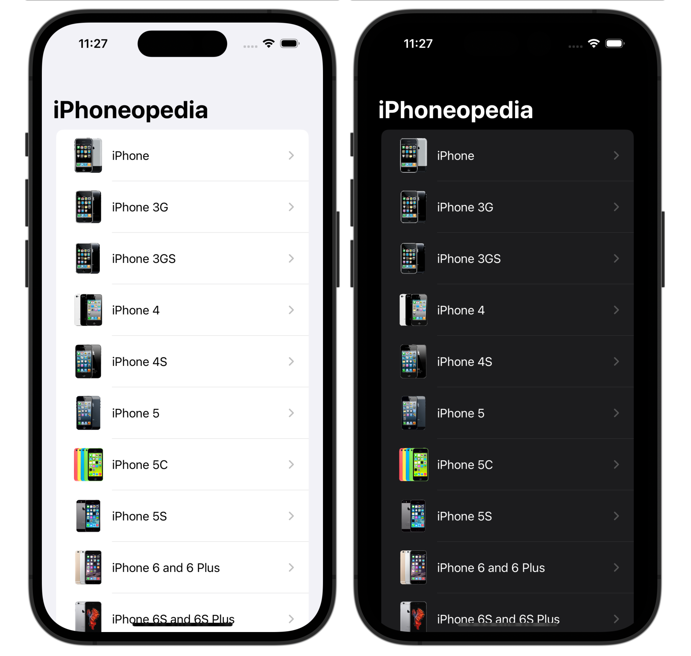
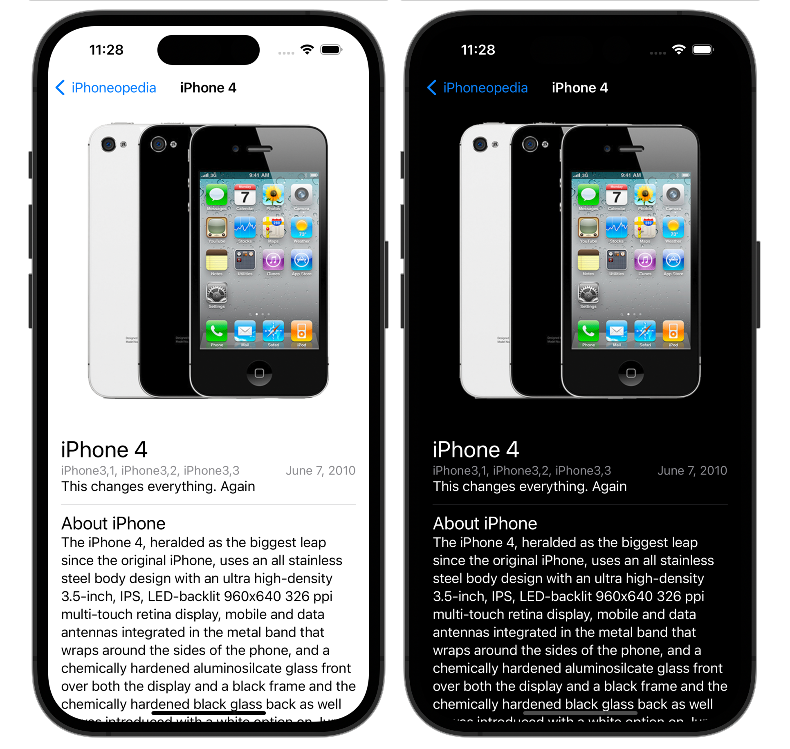

# iPhoneopedia

An encyclopedia of every iPhone, from the 2007 original to the iPhone Duo, built with SwiftUI for iOS 27.
The catalog updates itself: new models appear in the app without an App Store release.

## Features

- **iPhones**: every model grouped by year, with Apple's product photo, chip, colors, specs and history. "Your iPhone" is detected and pinned on top. Swipe sideways between models.
- **Trends**: Swift Charts of launch prices, screen sizes and models per year.
- **My iPhones**: mark the phones you've owned (SwiftData).
- **Ask**: on-device Apple Intelligence answers questions from the catalog, and identifies a model from a photo.
- **Search** tab, **Siri and Shortcuts** ("Show iPhone 4 in iPhoneopedia"), **Spotlight**, **Visual Intelligence** and a configurable **widget**.

## How the catalog updates itself

```
AppleDB (identifiers, chips, dates, colors) ─┐
Apple "Identify your iPhone model" (photos)  ├─► scripts/build-catalog.mjs ─► Shared/catalog.json
Wikipedia summaries (about text)             │   GitHub Action, daily        bundled in the app +
data/overrides.json (prices, sizes, fixes)  ─┘                               fetched from GitHub at launch
```

- To add or correct data, edit `data/overrides.json` and push. The Action validates and publishes; apps pick it up within minutes.
- To publish right now, use Actions → "Update catalog" → Run workflow.
- Tests: `node --test` for the pipeline, and ⌘U in Xcode for the app.

## Requirements

Xcode 27, iOS 27. Apple Intelligence features appear only on supported iPhones.
Building for the first time? Start with [HANDOFF.md](HANDOFF.md).

## Credits

Device data: [AppleDB](https://github.com/littlebyteorg/appledb) (MIT). About text: Wikipedia (CC BY-SA 4.0), linked in the app. Product photos © Apple, loaded from Apple's site.

## Original version (2022)



